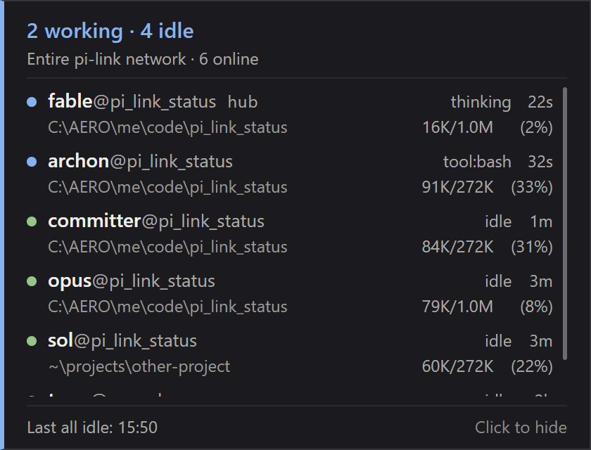

# pi-link-status

A small Windows system-tray companion for [pi-link](https://github.com/alvivar/pi-link): it watches the
local pi-link hub and shows, at a glance, whether your Pi coding-agent terminals are working or idle.
It does not run the hub or the terminals; it only reads what the hub already reports.

<p align="center">
  
</p>

## What it does

- **Tray icon by fleet state** — grey when no hub answers, blue while any terminal is working
  (thinking or running a tool) or when a state is unknown, amber while one is compacting,
  green when every terminal is idle. The tooltip summarizes the counts.
- **Status panel** — a compact, fixed-size window listing every terminal on the link: name,
  hub marker, current state and how long it has been in it, working directory (with your home
  folder shortened to `~`), and context-window usage (tokens used / window size, and a
  percentage).
- **All-idle alert** — after it has seen work happen, the panel opens once the whole fleet has
  been idle for two consecutive polls (roughly 2–4 s). Idle with no prior observed work does
  not open it. An unknown state breaks the two-poll confirmation streak; a terminal departure
  or hub loss disarms the pending cycle. The footer keeps the time of the last confirmed
  all-idle for the session.
- **Mute** — the tray menu's *Mute alerts* stops the panel from opening on its own; the time
  of the last all-idle still updates, and un-muting does not replay a suppressed alert.
- **Stays out of the way** — starts hidden in the tray, has no taskbar entry, and only one
  instance runs at a time (a second launch exits quietly).

## Requirements

- Windows. The app polls `http://127.0.0.1:9900/status`, waiting 2 seconds after each attempt
  settles before starting the next.
- A running pi-link hub that serves `GET /status`, i.e. **pi-link 0.4.0, or a later release
  with a compatible `/status` schema**, with at least one Pi terminal started with the link.
  Install and usage are documented in the [pi-link README](https://github.com/alvivar/pi-link#readme);
  if the hub predates `/status`, the app reports an outdated hub instead of data.

## Build and run

You need a Flutter SDK with Windows desktop support enabled (which requires Visual Studio with
the *Desktop development with C++* workload). The Dart constraint is in `pubspec.yaml`.

```powershell
flutter pub get
flutter build windows --release
```

The build lands in `build\windows\x64\runner\Release\`. Run `pi_link_status.exe` from there,
or copy the **whole `Release` folder**: the executable needs the DLLs and the `data`
directory next to it. There is no installer, autostart or settings UI.

## Using it

- The app appears only as a tray icon. **Left-click** the icon to show or hide the panel;
  **click inside the panel** to hide it again (it has no title bar or close button).
- **Right-click** the icon for the menu: *Show*/*Hide*, *Mute alerts* (checkbox) and *Quit*.
  Hiding the panel never quits the app; *Quit* does.
- When no hub answers, the panel says so and the icon turns grey. When you stop the hub
  terminal, another client promotes itself within a few seconds and the panel recovers on
  its own.

## Development

```powershell
flutter analyze
flutter test
flutter build windows --debug
```

Tray icons and the executable icon are generated files and committed, so a normal build never
needs the generators. To regenerate after editing the sources:

```powershell
dart run tool/gen_icons.dart       # assets/tray/*.png and *.ico from the state palette
dart run tool/gen_app_icon.dart    # windows/runner/resources/app_icon.ico from design/app-icon.png
```

Further reading in this repository:

- `docs/desktop-feasibility.md` — the research behind the window behaviour on Windows
  (why the panel activates when it opens, tray positioning limits, DPI).
- `design/grafito.html` — the panel design mockup the UI follows; `design/app-icon.svg` is the
  editable vector master of the executable icon.
- `third_party/tray_manager/PATCHES.md` — why the tray plugin is vendored (see below).

## Third-party notice

`third_party/tray_manager/` is a copy of the published
[`tray_manager`](https://pub.dev/packages/tray_manager) 0.5.3 package with a two-line fix to its
Windows plugin, wired in through `dependency_overrides` in `pubspec.yaml`. It keeps the
upstream [MIT license](third_party/tray_manager/LICENSE) verbatim; provenance, the exact delta
and how to drop the copy once upstream ships a fix are in
[`PATCHES.md`](third_party/tray_manager/PATCHES.md).

## Scope and limits

- **Windows only.** The `linux/` and `macos/` directories are Flutter scaffolding and have not
  been built or tested; the vendored plugin's non-Windows sources are unmodified and unused.
- The alert is the panel opening, not an OS notification, sound or global shortcut.
- The panel takes focus when it opens (see `docs/desktop-feasibility.md` for why), and it is
  centred on screen rather than anchored to the tray.
- The app shows what the hub reports: a terminal that is connected but stuck still counts as
  connected, and an unrecognised `status` word is shown as-is and counted as *unknown*.
